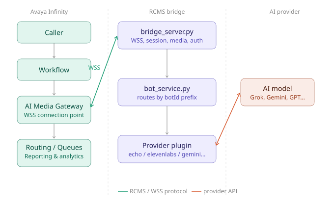

## §2 Architecture

The diagram above shows the three systems involved in every call.

**Avaya Infinity** is the contact center platform. It owns the caller experience end-to-end — routing inbound calls, executing workflows, managing queues, and capturing reporting and analytics. When a call reaches the AI self-service step in a workflow, Infinity's IVA module sends a `bot.start` message to the AI Media Gateway. The AI Media Gateway is the WSS endpoint the bridge connects to. From Infinity's perspective, the bridge is just a registered virtual agent — it receives the call, handles it, and signals the outcome via `bot.ended`.

**The RCMS bridge** (this repository) sits between Infinity and the AI provider. It accepts the WebSocket connection from the AI Media Gateway, manages the RCMS protocol session lifecycle, and routes each call to the correct provider plugin based on the `botId` prefix in the `bot.start` message. The bridge owns the audio pipeline — transcoding between Infinity's negotiated codec and the format each AI provider expects — and ensures every call exits cleanly via a spec-compliant `bot.ended` regardless of how the conversation ends.

**The AI provider** supplies the intelligence. The bridge connects to the provider's API, streams caller audio to it, and relays the provider's audio and transcript events back to Infinity. The provider guide for each integration covers the specifics of that connection.

The Echo provider (used in Part 1 of this guide) replaces the AI provider entirely — it loops caller audio back without connecting to any external service. This makes it the right tool for validating the foundation before introducing AI credentials and external dependencies.
